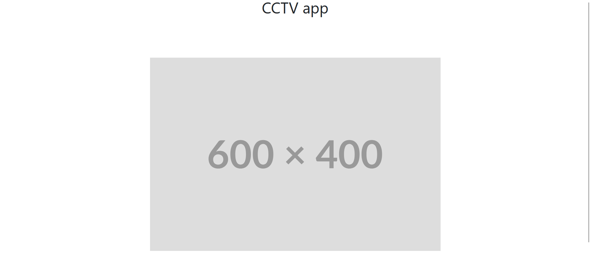

# CCTV Web App with Flask 🎥

This is a simple **CCTV web application** built using **Flask**, which allows you to view live video feeds from cameras, capture images, and manage camera settings all from a web interface. The app is designed to be a lightweight solution for managing CCTV systems and can be extended further to include more advanced features.

## Features 🚀

- **Live video streaming** from connected cameras 🎥
- **Capture snapshots** from video feed 📸
- **Manage camera settings** (e.g., resolution, refresh rate) ⚙️
- **User authentication** for secure access 🔐
- Easy-to-use **web interface** 🌐

## First look


## Requirements 📋

- Python 3.x 🐍
- Flask 🔥
- OpenCV (for handling video streaming) 🎞️
- (Optional) A camera device that supports RTSP or MJPEG streaming 🎥

## Installation 🛠️

Follow these steps to get the CCTV web app running locally.

### 1. Clone the repository

```bash
git clone https://github.com/Prajwalkulkarni766/cctv-app.git
cd flask-cctv-app
```

### 2. Create a virtual environment

```
python3 -m venv venv
```

#### For mac or linux
```
source venv/bin/activate 
```

#### For windows
```
venv\Scripts\activate

```

### 3. Install dependencies
```
pip install -r requirements.txt
```

### 4. Run the app
```
python app.py
```

## Configuration ⚙️
CAMERA_URL = http://127.0.0.1:5000/video

## Acknowledgements 🙏
 - Flask for providing the foundation of the web application framework.
 - OpenCV for handling video streams and image capture.


Feel free to improve and extend the functionality of this app for more advanced CCTV use cases. Happy coding! 👨‍💻👩‍💻